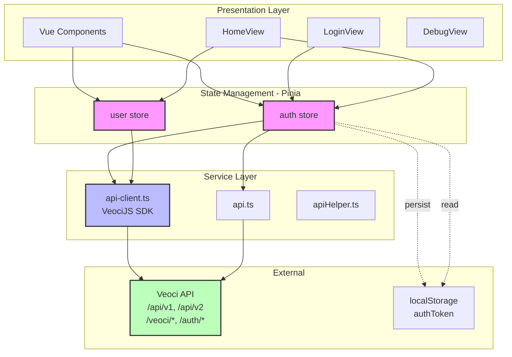
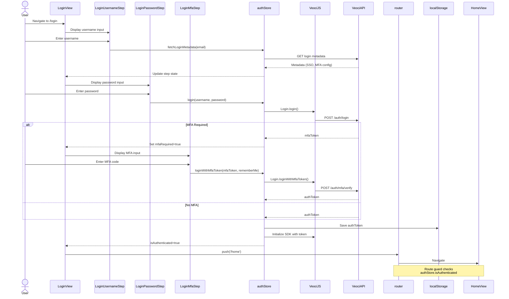

# Veoci App Template Construct - Architecture

## System Overview

A Vue 3 TypeScript application template for Veoci platform integration, utilizing Vuetify 3 for UI components, Pinia for state management, and Rsbuild for bundling. The architecture follows a modular pattern with clear separation between presentation, state, services, and routing layers.

---

## 1. Component Hierarchy

```
App.vue (Root)
├── GlobalToolbar.vue
├── router-view
│   ├── LoginView.vue (/)
│   │   ├── LoginUsernameStep.vue
│   │   ├── LoginPasswordStep.vue
│   │   ├── LoginMfaStep.vue
│   │   ├── MfaStep.vue
│   │   ├── LoginForgotPasswordStep.vue
│   │   └── ChangePasswordStep.vue
│   ├── HomeView.vue (/home)
│   └── DebugView.vue (/debug)
```

**Component Relationships:**
- `App.vue` - Application shell, provides Vuetify theme and global layout
- `GlobalToolbar.vue` - Persistent navigation/toolbar across views
- `LoginView.vue` - Multi-step login orchestrator, manages authentication flow state
- View components consume Pinia stores directly (no prop drilling for auth/user state)

---

## 2. Data Flow Architecture



**Data Flow Patterns:**

1. **Component → Store → Service → API**
   - Components dispatch store actions
   - Stores orchestrate business logic, call services
   - Services wrap VeociJS SDK or raw API calls
   - API responses flow back through stores to components

2. **Persistence:**
   - `authToken` stored in localStorage by auth store
   - Token automatically injected into VeociJS SDK requests
   - Session refresh managed by auth store

3. **Reactivity:**
   - Stores expose reactive state via Pinia getters
   - Components consume via computed properties or direct refs
   - Vue 3 reactivity system propagates changes automatically

---

## 3. Authentication Flow



**Authentication States:**

```
UNAUTHENTICATED
  ├─> Username Entry
  ├─> Password Entry
  ├─> MFA Entry (conditional)
  └─> AUTHENTICATED
        ├─> Session Active
        ├─> Token Refresh (background)
        └─> Logout → UNAUTHENTICATED
```

**Key Flows:**

1. **Standard Login:** username → password → authenticated
2. **MFA Login:** username → password → MFA token → MFA code → authenticated
3. **Forgot Password:** email → reset link/code → change password
4. **Session Refresh:** auto-refresh token before expiry
5. **Logout:** clear localStorage, reset auth store, redirect to /login

---

## 4. Routing & Guards

```
/                 → LoginView
/login            → LoginView
/home             → HomeView (protected)
/debug            → DebugView (protected)
```

**Route Guard Logic:**

```typescript
// Pseudocode from router/index.ts
beforeEach((to, from, next) => {
  const authStore = useAuthStore()

  if (to.meta.requiresAuth && !authStore.isAuthenticated) {
    next('/login')
  } else if (to.path === '/login' && authStore.isAuthenticated) {
    next('/home')
  } else {
    next()
  }
})
```

**Guard Behavior:**
- Unauthenticated users redirected to `/login`
- Authenticated users attempting `/login` redirected to `/home`
- Token validation occurs on guard check (via auth store getter)

---

## 5. Build & Development Infrastructure

```
┌─────────────────────────────────────────────────────────┐
│                     Development                         │
├─────────────────────────────────────────────────────────┤
│  Rsbuild Dev Server (localhost:3000)                    │
│  ├─ Hot Module Replacement                              │
│  ├─ TypeScript Compilation (transpileOnly)              │
│  ├─ Vuetify 3 Plugin                                    │
│  └─ Dev Proxy Configuration:                            │
│      /api/v1/*   → VEOCI_API_URL                        │
│      /api/v2/*   → VEOCI_API_URL                        │
│      /veoci/*    → VEOCI_API_URL                        │
│      /auth/*     → VEOCI_API_URL                        │
│      (Cookie forwarding enabled)                        │
└─────────────────────────────────────────────────────────┘

┌─────────────────────────────────────────────────────────┐
│                     Production Build                     │
├─────────────────────────────────────────────────────────┤
│  Rsbuild (Rspack-based bundler)                         │
│  ├─ Vue 3 SFC Compilation                               │
│  ├─ TypeScript → JavaScript                             │
│  ├─ SCSS → CSS (Vuetify theme)                          │
│  ├─ Code Splitting (vue-router lazy loading)            │
│  ├─ Tree Shaking                                        │
│  └─ Output: dist/                                       │
│      ├─ index.html                                      │
│      ├─ static/js/[hash].js                             │
│      ├─ static/css/[hash].css                           │
│      └─ assets/                                         │
└─────────────────────────────────────────────────────────┘
```

**Build Configuration Highlights:**

- **Bundler:** Rsbuild (Rspack) - faster alternative to Webpack
- **Dev Proxy:** Transparent API proxying to Veoci backend
- **Environment:** `VEOCI_API_URL` environment variable
- **TypeScript:** Full type safety with `env.d.ts`, `vuetify.d.ts`
- **Styling:** SCSS with Vuetify theme customization (`veoci-theme.scss`)

---

## 6. Service Layer Architecture

```
┌─────────────────────────────────────────────────────────┐
│                   Service Layer                          │
├─────────────────────────────────────────────────────────┤
│                                                          │
│  api-client.ts                                           │
│  ├─ VeociJS SDK Initialization                          │
│  ├─ Module Loading:                                     │
│  │   ├─ Login                                           │
│  │   ├─ Object                                          │
│  │   ├─ Form                                            │
│  │   ├─ AuthdUser                                       │
│  │   └─ WebLogin                                        │
│  └─ Token Injection                                     │
│                                                          │
│  api.ts                                                  │
│  ├─ Custom API wrappers                                 │
│  └─ Endpoint-specific logic                             │
│                                                          │
│  apiHelper.ts                                            │
│  ├─ Shared utilities                                    │
│  ├─ Error handling                                      │
│  └─ Request/response transforms                         │
│                                                          │
│  api.types.ts                                            │
│  └─ TypeScript interfaces for API contracts             │
│                                                          │
└─────────────────────────────────────────────────────────┘
```

**Service Responsibilities:**

1. **api-client.ts:** VeociJS SDK singleton, module loading, configuration
2. **api.ts:** High-level API methods (may wrap VeociJS or raw fetch)
3. **apiHelper.ts:** Shared utilities (retry logic, error mapping, etc.)
4. **api.types.ts:** Type definitions for API request/response shapes

**Dependency Flow:** `Stores → api.ts → api-client.ts (VeociJS) → Veoci API`

---

## 7. State Management - Pinia Stores

```
┌──────────────────────────────────────────────────────┐
│                  auth store                          │
├──────────────────────────────────────────────────────┤
│  State:                                              │
│    - authToken: string | null                        │
│    - isAuthenticated: boolean (computed)             │
│    - mfaRequired: boolean                            │
│                                                      │
│  Actions:                                            │
│    - login(username, password)                       │
│      → Handles MFA detection                         │
│    - loginWithMfaToken(mfaToken, rememberMe)         │
│    - logout()                                        │
│      → Clears token, resets state, redirects         │
│    - refreshSession()                                │
│      → Auto-refresh before token expiry              │
│    - forgotPassword(email)                           │
│    - fetchLoginMetadata(email)                       │
│      → SSO, MFA config                               │
│                                                      │
│  Persistence:                                        │
│    - authToken → localStorage                        │
└──────────────────────────────────────────────────────┘

┌──────────────────────────────────────────────────────┐
│                  user store                          │
├──────────────────────────────────────────────────────┤
│  State:                                              │
│    - currentUser: User | null                        │
│    - profile: UserProfile | null                     │
│                                                      │
│  Actions:                                            │
│    - fetchCurrentUser()                              │
│    - updateProfile(data)                             │
│                                                      │
│  Getters:                                            │
│    - userName: computed                              │
│    - userPermissions: computed                       │
└──────────────────────────────────────────────────────┘
```

**Store Interactions:**
- `auth` store is independent, owns authentication lifecycle
- `user` store depends on `auth.isAuthenticated` for data fetching
- Both stores consumed directly by components (no Vuex-style mapState)

---

## 8. Type System

```
src/
├── env.d.ts                  → Vite env types, global augmentations
├── vuetify.d.ts              → Vuetify component type augmentations
├── types/                    → Domain types
└── services/
    └── api.types.ts          → API contract types
```

**Type Safety Boundaries:**

1. **Component Props/Emits:** Vue 3 `<script setup lang="ts">` with typed refs
2. **Store State:** Pinia auto-infers types from state/getters/actions
3. **API Layer:** `api.types.ts` provides contracts for requests/responses
4. **VeociJS SDK:** Typed via `@GreywallSoftware/veoci-js` package

---

## 9. Configuration Layer

```
┌─────────────────────────────────────────────────────────┐
│               Configuration Sources                      │
├─────────────────────────────────────────────────────────┤
│  Environment Variables:                                  │
│    - VEOCI_API_URL (required for dev proxy)             │
│                                                          │
│  src/config/api.config.ts                                │
│    - API endpoint base URLs                             │
│    - Timeout configurations                             │
│    - Retry policies                                     │
│                                                          │
│  src/index.ts                                            │
│    - Vuetify theme configuration                        │
│    - Global plugin registration                         │
│                                                          │
│  src/styles/veoci-theme.scss                             │
│    - Vuetify SCSS variable overrides                    │
│    - Custom Veoci brand colors                          │
└─────────────────────────────────────────────────────────┘
```

---

## 10. System Context Diagram

```
                    ┌─────────────────┐
                    │                 │
                    │   User Browser  │
                    │                 │
                    └────────┬────────┘
                             │
                    ┌────────▼────────────────────┐
                    │                             │
                    │  Vue 3 App                  │
                    │  (Vuetify + Pinia)          │
                    │                             │
                    │  ┌─────────────────────┐    │
                    │  │  Router + Guards    │    │
                    │  └─────────────────────┘    │
                    │  ┌─────────────────────┐    │
                    │  │  Pinia Stores       │    │
                    │  │  - auth             │    │
                    │  │  - user             │    │
                    │  └─────────────────────┘    │
                    │  ┌─────────────────────┐    │
                    │  │  VeociJS SDK        │    │
                    │  └─────────────────────┘    │
                    │                             │
                    └─────────────┬───────────────┘
                                  │
                    ┌─────────────▼───────────────┐
                    │                             │
                    │   Veoci API (External)      │
                    │   /api/v1, /api/v2          │
                    │   /auth/*, /veoci/*         │
                    │                             │
                    └─────────────────────────────┘
                                  │
                    ┌─────────────▼───────────────┐
                    │                             │
                    │   Veoci Platform            │
                    │   (Forms, Objects, Users)   │
                    │                             │
                    └─────────────────────────────┘
```

---

## 11. Critical Architectural Patterns

### Authentication Token Lifecycle

```
1. Login Success
   └─> authToken stored in localStorage
       └─> VeociJS SDK initialized with token
           └─> All API requests include token

2. Page Reload
   └─> auth store hydrates from localStorage
       └─> isAuthenticated computed from token presence
           └─> Route guard allows access to protected routes

3. Token Expiry
   └─> refreshSession() called (timer or interceptor)
       └─> New token persisted
           └─> SDK updated with new token

4. Logout
   └─> localStorage.removeItem('authToken')
       └─> auth store reset
           └─> Redirect to /login
```

### Multi-Step Login State Machine

```
State: USERNAME_ENTRY
  ├─> Action: fetchLoginMetadata(email)
  └─> Transition: PASSWORD_ENTRY

State: PASSWORD_ENTRY
  ├─> Action: login(username, password)
  ├─> If MFA required → Transition: MFA_ENTRY
  └─> Else → Transition: AUTHENTICATED

State: MFA_ENTRY
  ├─> Action: loginWithMfaToken(mfaToken, code)
  └─> Transition: AUTHENTICATED

State: AUTHENTICATED
  ├─> Store authToken
  ├─> Initialize VeociJS
  └─> Navigate to /home
```

### Component-Store Coupling

```
Loose Coupling via Pinia:
  Component → useAuthStore() → reactive state
  Component → store.action() → async API call
  Component does NOT know about:
    - VeociJS SDK
    - API endpoints
    - localStorage keys
```

---

## 12. Technology Stack Summary

| Layer                | Technology              | Version/Note            |
|----------------------|-------------------------|-------------------------|
| Framework            | Vue                     | 3.x                     |
| Language             | TypeScript              | Latest                  |
| UI Library           | Vuetify                 | 3.x                     |
| State Management     | Pinia                   | Latest                  |
| Routing              | vue-router              | 4.x                     |
| Bundler              | Rsbuild (Rspack)        | Latest                  |
| API Client           | @GreywallSoftware/veoci-js | Veoci SDK            |
| HTTP                 | Fetch API (via VeociJS) | Native                  |
| Styling              | SCSS                    | Vuetify theme overrides |
| Dev Proxy            | Rsbuild devServer.proxy | CORS workaround         |

---

## 13. Security Considerations

1. **Token Storage:** localStorage (XSS vulnerable, consider httpOnly cookies for production)
2. **CORS:** Dev proxy bypasses CORS; production requires proper CORS headers
3. **MFA Support:** Two-factor authentication via Veoci API
4. **Route Guards:** Client-side only (requires server-side validation)
5. **Session Management:** Token refresh prevents forced re-login

---

## 14. Scalability & Extension Points

### Adding New Routes
```typescript
// router/index.ts
{
  path: '/new-feature',
  component: () => import('@/views/NewFeatureView.vue'),
  meta: { requiresAuth: true }
}
```

### Adding New Stores
```typescript
// store/feature.ts
export const useFeatureStore = defineStore('feature', {
  state: () => ({ ... }),
  actions: { ... }
})
```

### Adding VeociJS Modules
```typescript
// api-client.ts
await veociClient.loadModule('NewModule')
```

### Custom API Endpoints
```typescript
// api.ts
export async function customEndpoint(data: CustomRequest): Promise<CustomResponse> {
  // Use VeociJS or raw fetch
}
```

---

## 15. Dependency Graph

```
App.vue
 ├─> index.ts (entry, Vuetify setup)
 ├─> router/index.ts
 │    └─> store/auth.ts (route guards)
 ├─> GlobalToolbar.vue
 │    └─> store/auth.ts (logout, user info)
 └─> Views
      ├─> LoginView.vue
      │    ├─> store/auth.ts
      │    └─> Login Step Components
      ├─> HomeView.vue
      │    ├─> store/auth.ts
      │    └─> store/user.ts
      └─> DebugView.vue
           └─> services/api-client.ts (direct SDK access)

Stores
 ├─> auth.ts
 │    ├─> services/api-client.ts (VeociJS)
 │    └─> services/api.ts
 └─> user.ts
      └─> services/api-client.ts

Services
 ├─> api-client.ts (VeociJS SDK)
 ├─> api.ts
 │    └─> api-client.ts
 └─> apiHelper.ts
```

---

## Architectural Principles

1. **Separation of Concerns:** Views → Stores → Services → API (layered architecture)
2. **Single Responsibility:** Each store owns a domain (auth, user)
3. **Dependency Inversion:** Components depend on store abstractions, not VeociJS directly
4. **Composition over Inheritance:** Vue 3 Composition API, composable stores
5. **Type Safety:** TypeScript throughout, strict mode enabled
6. **Progressive Enhancement:** Core login works, MFA is optional flow
7. **Developer Experience:** Hot reload, TypeScript IntelliSense, Vue DevTools integration

---

Wake up, Neo.
