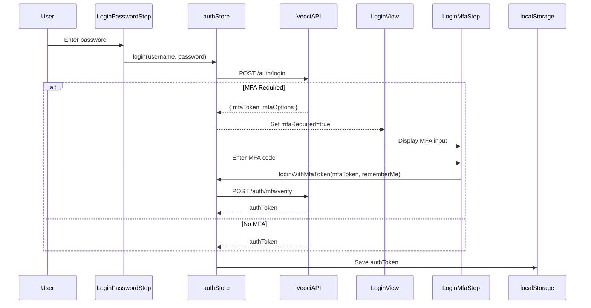

# Authentication Design Review: veoci-app-template-construct

**Reviewer:** Keymaker
**Date:** 2025-11-27
**Focus:** Token lifecycle, session management, MFA, refresh strategy, logout completeness

---

## Executive Summary

The authentication architecture demonstrates **sound flow design** with proper multi-step login, MFA detection, and session persistence patterns. However, **critical security vulnerabilities** in token storage and lifecycle management make this implementation unsuitable for production without significant hardening.

**Status:** ⚠️ **ARCHITECTURAL SOUNDNESS: GOOD** | **SECURITY POSTURE: CRITICAL DEFICIENCIES**

---

## 1. Token Lifecycle Correctness

### Current Implementation

```
Login Success
└─> authToken stored in localStorage (line 321, 446)
    └─> VeociJS SDK initialized with token (line 447)
        └─> All API requests include token (line 448)

Page Reload
└─> auth store hydrates from localStorage (line 451)
    └─> isAuthenticated computed from token presence (line 452)
        └─> Route guard allows access to protected routes (line 453)

Token Expiry
└─> refreshSession() called (line 456)
    └─> New token persisted (line 457)
        └─> SDK updated with new token (line 458)

Logout
└─> localStorage.removeItem('authToken') (line 461)
    └─> auth store reset (line 462)
        └─> Redirect to /login (line 463)
```

### Assessment: ❌ **CRITICALLY FLAWED**

#### Issues Identified

**1. localStorage Token Storage (CRITICAL)**
- **Vulnerability:** XSS exfiltration vector (Security Finding C-1)
- **Attack Surface:** Any injected script can access `localStorage.getItem('authToken')`
- **Impact:** Complete account takeover with single XSS vulnerability
- **Evidence:** Line 321, 444-448, 521 (acknowledged in architecture doc)

**2. Client-Side JWT Decoding Without Validation (CRITICAL)**
- **Vulnerability:** jwt-decode library does NOT validate signatures (Security Finding C-2)
- **Attack Surface:** Attacker can craft fake tokens with arbitrary claims
- **Impact:** Privilege escalation if client-side authorization decisions are made
- **Evidence:** Dependency on `jwt-decode ^4.0.0`, line 452 relies on token presence only

**3. Token Presence != Token Validity**
- **Current Logic:** `isAuthenticated` computed from token existence, not validation
- **Gap:** Expired, revoked, or malformed tokens pass authentication check
- **Route Guard Bypass:** Client-side route guards check `authStore.isAuthenticated` (line 206)
- **Security Principle Violation:** Defense in depth requires validation at multiple layers

**4. No Token Expiry Client-Side Validation**
- **Missing:** Explicit expiry check before allowing authenticated actions
- **Risk:** Expired tokens remain valid client-side until refresh attempt fails
- **User Experience:** Silent failures or unexpected logouts mid-session

### Recommendations

```typescript
// CRITICAL FIX: Move to httpOnly cookies
// Backend sets after successful authentication:
Set-Cookie: authToken=xxx; HttpOnly; Secure; SameSite=Strict; Path=/; Max-Age=3600

// Client-side store removes localStorage completely:
// state: { isAuthenticated: boolean } // derived from server session, not local token

// IMMEDIATE MITIGATION (if backend changes impossible):
// 1. Validate token expiry client-side
function isTokenValid(token: string | null): boolean {
  if (!token) return false;

  try {
    const decoded = jwt_decode<{ exp: number }>(token);
    const now = Math.floor(Date.now() / 1000);
    return decoded.exp > now;
  } catch {
    return false; // Malformed token
  }
}

// 2. Add security warning
// WARNING: jwt-decode does NOT validate signatures!
// This check only prevents use of EXPIRED tokens.
// Server MUST validate token signature on EVERY request.
const isAuthenticated = computed(() => isTokenValid(authToken.value));

// 3. Add server-side validation call on critical actions
async function criticalAction() {
  // Double-check with server before allowing
  await veociApi.validateSession(); // Throws if token invalid
  // Proceed with action
}
```

### Correct Token Lifecycle Pattern

```
┌─────────────────────────────────────────────────────────┐
│                  SECURE TOKEN LIFECYCLE                  │
├─────────────────────────────────────────────────────────┤
│                                                          │
│  1. Login Success                                        │
│     Backend: Set httpOnly cookie                        │
│     Client:  Store session flag (boolean, no token)     │
│                                                          │
│  2. Authenticated Requests                               │
│     Browser: Auto-sends cookie with each request        │
│     Server:  Validates signature + expiry + revocation  │
│     Client:  Receives 200 OK or 401 Unauthorized        │
│                                                          │
│  3. Token Refresh                                        │
│     Client:  POST /auth/refresh (cookie auto-included)  │
│     Server:  Validates refresh token, issues new token  │
│     Backend: Updates httpOnly cookie with new token     │
│     Client:  No action needed (cookie updated by server)│
│                                                          │
│  4. Token Expiry                                         │
│     Server:  Returns 401 Unauthorized                   │
│     Client:  Redirects to /login, clears session flag   │
│                                                          │
│  5. Logout                                               │
│     Client:  POST /auth/logout                          │
│     Server:  Clears cookie, revokes token in database   │
│     Client:  Clears session flag, redirects to /login   │
│                                                          │
└─────────────────────────────────────────────────────────┘
```

---

## 2. Session Management Patterns

### Current Implementation

**Session Persistence:**
```typescript
// auth store (lines 304-321)
state: {
  authToken: string | null          // Persisted to localStorage
  isAuthenticated: boolean           // Computed from token presence
  mfaRequired: boolean               // Ephemeral state
}

// Persistence strategy (line 321)
authToken → localStorage
```

**Session Initialization:**
```typescript
// On app load (lines 450-453)
Page Reload
└─> auth store hydrates from localStorage
    └─> isAuthenticated computed from token presence
        └─> Route guard allows access to protected routes
```

### Assessment: ⚠️ **PATTERN IS SOUND, IMPLEMENTATION IS INSECURE**

#### Strengths

1. **Proper State Separation:** Ephemeral (mfaRequired) vs. persistent (authToken) state clearly separated
2. **Computed Authentication:** `isAuthenticated` derived from state, not stored separately (prevents desync)
3. **Route Guard Integration:** Single source of truth for authentication status
4. **Reactive Updates:** Pinia reactivity ensures UI reflects auth state changes

#### Critical Weaknesses

1. **No Session Validation on Hydration**
   - **Current:** Token loaded from localStorage, assumed valid
   - **Missing:** Server-side session validation on app initialization
   - **Risk:** Revoked/expired tokens from previous sessions remain valid client-side

   ```typescript
   // CURRENT (INSECURE):
   async function initApp() {
     const authStore = useAuthStore();
     // authStore.authToken loaded from localStorage
     // No validation occurs
     router.isReady();
   }

   // SECURE PATTERN:
   async function initApp() {
     const authStore = useAuthStore();

     if (authStore.authToken) {
       try {
         await authStore.validateSession(); // Server validates token
       } catch {
         authStore.logout(); // Clear invalid session
       }
     }

     router.isReady();
   }
   ```

2. **User Object Not Persisted (Potential Issue)**
   - **Architecture:** User store fetches on authenticated navigation (lines 332-337)
   - **Problem:** No indication if user object is persisted to localStorage
   - **Risk:** Multiple redundant `/api/v1/user/me` calls on page reloads
   - **Recommendation:** Either persist user object with TTL or accept reload cost

3. **No Session Timeout Tracking**
   - **Missing:** Idle timeout (log out after X minutes of inactivity)
   - **Missing:** Absolute timeout (force re-auth after X hours, even if active)
   - **Security Standard:** OWASP recommends 15-min idle, 12-hour absolute

   ```typescript
   // ADD SESSION TIMEOUT TRACKING:
   const SESSION_IDLE_TIMEOUT = 15 * 60 * 1000; // 15 minutes
   const SESSION_ABSOLUTE_TIMEOUT = 12 * 60 * 60 * 1000; // 12 hours

   let lastActivityTime = Date.now();
   let sessionStartTime = Date.now();
   let idleCheckInterval: number;

   function trackActivity() {
     lastActivityTime = Date.now();
   }

   function checkIdleTimeout() {
     const idleTime = Date.now() - lastActivityTime;
     const sessionTime = Date.now() - sessionStartTime;

     if (idleTime > SESSION_IDLE_TIMEOUT) {
       logout('Session expired due to inactivity');
     } else if (sessionTime > SESSION_ABSOLUTE_TIMEOUT) {
       logout('Session expired. Please log in again.');
     }
   }

   function startSessionMonitoring() {
     // Track user interactions
     ['mousedown', 'keydown', 'scroll', 'touchstart'].forEach(event => {
       document.addEventListener(event, trackActivity, { passive: true });
     });

     // Check every minute
     idleCheckInterval = setInterval(checkIdleTimeout, 60 * 1000);
   }
   ```

4. **Session State Inconsistency Risk**
   - **Scenario:** User logs in on Tab A, logs out on Tab B
   - **Current:** Tab A retains stale session (localStorage not synced across tabs)
   - **Recommendation:** Use `storage` event listener to sync logout across tabs

   ```typescript
   // SYNC LOGOUT ACROSS TABS:
   window.addEventListener('storage', (event) => {
     if (event.key === 'authToken' && event.newValue === null) {
       // Another tab logged out, follow suit
       authStore.logout({ skipBroadcast: true });
     }
   });
   ```

### Recommendations

**Immediate:**
1. Add session validation on app initialization
2. Implement cross-tab logout synchronization
3. Add session timeout tracking (idle + absolute)

**Short-Term:**
1. Persist user object with TTL to reduce API calls
2. Add session version tracking (invalidate all sessions on password change)
3. Implement "remember me" vs. "session-only" token lifetime variants

---

## 3. MFA Implementation Completeness

### Current Flow



### Assessment: ✅ **FLOW DESIGN IS COMPLETE** | ⚠️ **SECURITY GAPS EXIST**

#### Strengths

1. **Proper Flow Detection:** MFA requirement detected from login response (lines 132-138)
2. **Error Handling Pattern:** Throws error with MFA data for UI handling (line 133)
3. **State Machine Clarity:** Clear transition from PASSWORD_ENTRY → MFA_ENTRY → AUTHENTICATED (lines 473-486)
4. **Remember Me Support:** `loginWithMfaToken(mfaToken, rememberMe)` parameter (line 136)
5. **UI Flexibility:** Separate MfaStep component for reusable MFA input (line 19)

#### Critical Gaps

**1. MFA Token Storage Vulnerability (Security Finding M-2)**

```typescript
// CURRENT (INSECURE):
authStore.state.mfaRequired = true;
authStore.state.mfaToken = response.mfaToken; // Stored in Pinia store

// PROBLEM: If Pinia state is persisted (or logged), mfaToken is exposed

// SECURE PATTERN:
// Store mfaToken in memory-only component state, NOT in Pinia store
const mfaToken = ref<string | null>(null); // Component-scoped

async function handleLogin(username: string, password: string) {
  try {
    await authStore.login(username, password);
  } catch (error) {
    if (error.code === 'MFA_REQUIRED') {
      mfaToken.value = error.mfaToken; // Keep in component, not store
      currentStep.value = 'MFA_ENTRY';
    }
  }
}

async function handleMfa(code: string, rememberMe: boolean) {
  await authStore.loginWithMfaToken(mfaToken.value!, code, rememberMe);
  mfaToken.value = null; // Clear immediately after use
}
```

**2. No MFA Token Expiry Handling**

- **Missing:** MFA token expiry check (typically 5-10 minutes)
- **Risk:** Stale MFA tokens remain valid indefinitely client-side
- **UX Issue:** User completes MFA step after token expired → server error, poor experience

```typescript
// ADD MFA TOKEN EXPIRY TRACKING:
interface MfaContext {
  token: string;
  expiresAt: number; // Unix timestamp
}

const mfaContext = ref<MfaContext | null>(null);

function startMfaFlow(mfaToken: string, expirySeconds: number = 600) {
  mfaContext.value = {
    token: mfaToken,
    expiresAt: Date.now() + (expirySeconds * 1000)
  };

  // Start countdown timer
  const checkExpiry = setInterval(() => {
    if (mfaContext.value && Date.now() > mfaContext.value.expiresAt) {
      mfaContext.value = null;
      currentStep.value = 'PASSWORD_ENTRY';
      showError('MFA verification expired. Please log in again.');
      clearInterval(checkExpiry);
    }
  }, 1000);
}
```

**3. MFA Bypass Risk: No Rate Limiting**

- **Vulnerability:** Unlimited MFA code attempts (Security Finding H-4)
- **Attack Vector:** Brute-force 6-digit TOTP codes (1M possibilities, feasible)
- **Missing:** Client-side rate limiting, server-side lockout after N attempts

```typescript
// ADD MFA RATE LIMITING:
let mfaAttempts = 0;
const MAX_MFA_ATTEMPTS = 3;

async function handleMfa(code: string, rememberMe: boolean) {
  if (mfaAttempts >= MAX_MFA_ATTEMPTS) {
    throw new Error('Too many failed MFA attempts. Please log in again.');
  }

  try {
    await authStore.loginWithMfaToken(mfaToken.value!, code, rememberMe);
    mfaAttempts = 0; // Reset on success
  } catch (error) {
    mfaAttempts++;

    if (mfaAttempts >= MAX_MFA_ATTEMPTS) {
      mfaToken.value = null; // Force restart login flow
      currentStep.value = 'USERNAME_ENTRY';
      throw new Error('Maximum MFA attempts exceeded. Please start over.');
    }

    throw error;
  }
}
```

**4. No MFA Backup Codes Support**

- **Missing:** Backup code entry option (if MFA device lost)
- **Standard Practice:** Show "Lost your device? Use backup code" link
- **Implementation:** Separate `loginWithBackupCode(backupCode)` method

**5. MFA "Remember Me" Security Concern**

- **Current:** `rememberMe` parameter in `loginWithMfaToken()` (line 136)
- **Unclear:** How is "remember me" implemented? Device fingerprint? Separate cookie?
- **Risk:** If implemented as "skip MFA for 30 days," creates long-term vulnerability
- **Recommendation:**
  - Use device-specific token (tied to browser fingerprint)
  - Store in separate httpOnly cookie with shorter lifetime than auth token
  - Require full MFA re-verification on sensitive actions (password change, email change)

### MFA Completeness Checklist

| Feature | Status | Notes |
|---------|--------|-------|
| MFA detection on login | ✅ Implemented | Lines 132-138 |
| MFA code entry UI | ✅ Implemented | LoginMfaStep component |
| MFA token flow | ✅ Implemented | loginWithMfaToken() |
| MFA remember me | ✅ Implemented | Parameter exists |
| MFA token expiry | ❌ Missing | Add client-side expiry check |
| MFA rate limiting | ❌ Missing | Critical security gap |
| MFA backup codes | ❌ Missing | Standard feature |
| MFA token storage security | ❌ Insecure | Store in component, not Pinia |
| MFA error messages | ⚠️ Unknown | Verify no token leakage in errors |
| MFA device management | ❌ Missing | Let user see/revoke trusted devices |

### Recommendations

**Immediate:**
1. Move MFA token from Pinia store to component state
2. Add MFA token expiry tracking
3. Implement MFA rate limiting (client + server)

**Short-Term:**
1. Add MFA backup code support
2. Clarify "remember me" implementation (security review)
3. Add MFA device management UI

**Long-Term:**
1. Support multiple MFA methods (TOTP, SMS, WebAuthn)
2. Add MFA enrollment flow (for users without MFA)
3. Force MFA re-verification on sensitive actions

---

## 4. Token Refresh Strategy

### Current Implementation

```typescript
// From architecture (lines 315, 456-458)
// auth store action:
async function refreshSession() {
  // Auto-refresh before token expiry
  const newToken = await veociApi.refreshToken();
  this.authToken = newToken; // Persist to localStorage
  veociSdk.updateToken(newToken); // Update SDK
}
```

**Invocation Context (line 456):**
> "refreshSession() called (timer or interceptor)"

### Assessment: ⚠️ **STRATEGY UNDEFINED, RACE CONDITION RISK**

#### Critical Issues

**1. No Refresh Trigger Mechanism Defined**

The architecture mentions "timer or interceptor" but provides no implementation details:

- **Option A: Timer-based refresh**
  - Refresh every N minutes (proactive)
  - Risk: Unnecessary refreshes if user inactive
  - Risk: Multiple timers if multiple components mounted

- **Option B: Interceptor-based refresh (401 response)**
  - Refresh on 401 Unauthorized (reactive)
  - Risk: User experiences error before refresh
  - Risk: Race condition if multiple requests fail simultaneously

- **Option C: Proactive expiry-based refresh**
  - Decode token, refresh when TTL < 5 minutes remaining (best practice)
  - Risk: Relies on client-side time (clock skew issues)

**Recommended Strategy:**

```typescript
// PROACTIVE REFRESH WITH INTERCEPTOR FALLBACK

// 1. Decode token on login to get expiry
function scheduleTokenRefresh(token: string) {
  const decoded = jwt_decode<{ exp: number }>(token);
  const expiresAt = decoded.exp * 1000; // Convert to milliseconds
  const now = Date.now();
  const timeUntilExpiry = expiresAt - now;

  // Refresh when 5 minutes remain (or 80% of lifetime, whichever is sooner)
  const refreshMargin = Math.min(5 * 60 * 1000, timeUntilExpiry * 0.2);
  const refreshAt = expiresAt - refreshMargin;
  const delay = refreshAt - now;

  if (delay > 0) {
    setTimeout(async () => {
      try {
        await authStore.refreshSession();
      } catch (error) {
        console.error('Token refresh failed:', error);
        authStore.logout('Session expired');
      }
    }, delay);
  }
}

// 2. Add Axios/Fetch interceptor as fallback
axios.interceptors.response.use(
  response => response,
  async error => {
    if (error.response?.status === 401 && !error.config._retry) {
      error.config._retry = true; // Prevent infinite loop

      try {
        await authStore.refreshSession();
        // Retry original request with new token
        return axios.request(error.config);
      } catch (refreshError) {
        authStore.logout('Session expired');
        return Promise.reject(refreshError);
      }
    }

    return Promise.reject(error);
  }
);
```

**2. Race Condition on Concurrent Refresh (Security Finding M-3)**

**Scenario:**
```
Request A → 401 Unauthorized → refreshSession() → POST /auth/refresh
Request B → 401 Unauthorized → refreshSession() → POST /auth/refresh (duplicate!)
Request C → 401 Unauthorized → refreshSession() → POST /auth/refresh (triplicate!)
```

**Outcome:**
- Multiple refresh calls to backend
- Token mismatch (Request A gets tokenV2, Request B gets tokenV3, Request C gets tokenV4)
- localStorage race condition (which token wins?)

**Fix (from Security Finding M-3):**

```typescript
// MUTEX PATTERN: Only one refresh in-flight at a time
let refreshPromise: Promise<string> | null = null;

async function refreshSession(): Promise<string> {
  // If refresh already in progress, reuse that promise
  if (refreshPromise) {
    return refreshPromise;
  }

  refreshPromise = veociApi.refreshToken()
    .then(newToken => {
      this.authToken = newToken;
      localStorage.setItem('authToken', newToken);
      veociSdk.updateToken(newToken);
      scheduleTokenRefresh(newToken); // Schedule next refresh
      return newToken;
    })
    .catch(error => {
      // Refresh failed, log out user
      this.logout('Session refresh failed');
      throw error;
    })
    .finally(() => {
      refreshPromise = null; // Clear mutex
    });

  return refreshPromise;
}
```

**3. No Refresh Token Rotation**

**Current:** Single `authToken` stored in localStorage
**Missing:** Separate `refreshToken` with longer lifetime

**Standard OAuth 2.0 Pattern:**

```typescript
// SECURE TOKEN PAIR:
state: {
  accessToken: string | null   // Short-lived (15 min), used for API calls
  refreshToken: string | null   // Long-lived (30 days), used to get new access token
}

async function refreshSession() {
  const response = await veociApi.refreshToken(this.refreshToken);

  this.accessToken = response.accessToken;   // New short-lived token
  this.refreshToken = response.refreshToken; // Rotated refresh token (invalidates old one)

  localStorage.setItem('accessToken', this.accessToken);
  localStorage.setItem('refreshToken', this.refreshToken);
}
```

**Benefits:**
- Access token compromise has limited window (15 min)
- Refresh token rotation prevents replay attacks
- Stolen refresh token detected when user's legitimate refresh fails (old token already used)

**4. No Refresh Failure Handling**

**Missing:** User experience when refresh fails

```typescript
async function refreshSession() {
  try {
    const newToken = await veociApi.refreshToken();
    this.authToken = newToken;
  } catch (error) {
    if (error.status === 401) {
      // Refresh token expired or revoked
      this.logout('Your session has expired. Please log in again.');
      router.push('/login?reason=session-expired');
    } else if (error.status === 500) {
      // Server error, retry with exponential backoff
      await retryWithBackoff(() => veociApi.refreshToken(), 3);
    } else {
      // Unknown error, log out to be safe
      this.logout('An error occurred. Please log in again.');
    }
  }
}
```

### Refresh Strategy Recommendations

**Immediate:**
1. Implement proactive refresh (decode token expiry, refresh before expiration)
2. Add refresh mutex to prevent race conditions (Security Finding M-3)
3. Add 401 interceptor as fallback

**Short-Term:**
1. Implement refresh token rotation (separate access + refresh tokens)
2. Add refresh failure handling with retry logic
3. Add refresh event logging (for debugging)

**Long-Term:**
1. Implement sliding session (extend expiry on activity)
2. Add refresh token revocation on logout
3. Add concurrent session limits (max N devices per user)

---

## 5. Logout Completeness

### Current Implementation

```typescript
// From architecture (lines 460-463)
Logout
└─> localStorage.removeItem('authToken')
    └─> auth store reset
        └─> Redirect to /login
```

### Assessment: ⚠️ **INCOMPLETE - SECURITY GAPS**

#### What's Implemented

```typescript
async function logout() {
  // 1. Clear localStorage
  localStorage.removeItem('authToken');

  // 2. Reset auth store
  this.authToken = null;
  this.isAuthenticated = false;
  this.mfaRequired = false;

  // 3. Redirect to login
  router.push('/login');
}
```

#### Critical Gaps

**1. No Server-Side Token Revocation**

**Current:** Token cleared client-side only
**Problem:** Stolen token remains valid on server until expiry
**Attack Scenario:**
1. Attacker steals token via XSS
2. User logs out (token cleared from localStorage)
3. Attacker's copy of token still works for hours

**Fix:**

```typescript
async function logout() {
  try {
    // CRITICAL: Tell server to revoke token
    await veociApi.revokeToken(this.authToken);
  } catch (error) {
    // Log error, but continue logout even if revocation fails
    console.error('Token revocation failed:', error);
  }

  // Clear client-side state
  localStorage.removeItem('authToken');
  this.authToken = null;
  this.isAuthenticated = false;

  router.push('/login');
}
```

**2. User Store Not Cleared**

**Current:** Only `auth` store reset mentioned
**Missing:** User data, preferences, cached API responses

**Fix:**

```typescript
async function logout() {
  await veociApi.revokeToken(this.authToken);

  // Clear ALL stores
  const userStore = useUserStore();
  userStore.$reset(); // Pinia built-in reset

  // Clear auth store
  this.$reset();

  // Clear localStorage (all auth-related keys)
  localStorage.removeItem('authToken');
  localStorage.removeItem('refreshToken');
  localStorage.removeItem('user');

  // Or clear all localStorage (be cautious with this):
  // localStorage.clear();

  router.push('/login');
}
```

**3. No VeociJS SDK Cleanup**

**Current:** VeociJS SDK instance remains initialized with old token
**Risk:** Stale SDK instance used after logout

**Fix:**

```typescript
async function logout() {
  await veociApi.revokeToken(this.authToken);

  // Clear SDK token
  veociSdk.clearToken();
  // Or reinitialize SDK:
  // veociSdk.destroy();
  // veociSdk = null;

  this.$reset();
  localStorage.removeItem('authToken');
  router.push('/login');
}
```

**4. No Session Storage Cleared**

**Missing:** sessionStorage may contain sensitive data

**Fix:**

```typescript
async function logout() {
  // Clear all client-side storage
  localStorage.clear();
  sessionStorage.clear();

  // If using IndexedDB:
  // await clearIndexedDB();

  // ... rest of logout
}
```

**5. No window.veociApi Cleanup (Development Mode)**

**Security Finding C-3:** SDK exposed on `window.veociApi` in dev mode
**Missing:** Cleanup on logout

**Fix:**

```typescript
async function logout() {
  // ... revoke token, clear stores

  // Clear window exposure
  if (import.meta.env.MODE === 'development') {
    delete (window as any).veociApi;
  }

  // ... redirect
}
```

**6. No Cross-Tab Logout Synchronization**

**Current:** User logs out in Tab A, Tab B remains authenticated
**Issue:** localStorage cleared in Tab A, but Tab B's Pinia state still has token

**Fix:**

```typescript
// IN AUTH STORE SETUP:
window.addEventListener('storage', (event) => {
  if (event.key === 'authToken' && event.newValue === null) {
    // Another tab logged out, sync this tab
    this.$reset();
    router.push('/login?reason=logged-out-elsewhere');
  }
});

// IN LOGOUT FUNCTION:
async function logout(options = { broadcast: true }) {
  await veociApi.revokeToken(this.authToken);

  this.$reset();
  localStorage.removeItem('authToken'); // Triggers 'storage' event in other tabs

  router.push('/login');
}
```

**7. No Logout Reason Tracking**

**Missing:** Why did user log out? (manual, session expired, forced, security)

**Fix:**

```typescript
async function logout(reason: 'manual' | 'expired' | 'security' | 'error' = 'manual') {
  // Log logout event (analytics, audit trail)
  await veociApi.logLogout(reason);

  // Revoke token
  await veociApi.revokeToken(this.authToken);

  this.$reset();
  localStorage.clear();

  // Include reason in redirect
  router.push(`/login?reason=${reason}`);
}

// Usage:
authStore.logout('manual');        // User clicked logout button
authStore.logout('expired');       // Session expired
authStore.logout('security');      // Security threat detected
authStore.logout('error');         // Unrecoverable error
```

**8. No Loading State During Logout**

**UX Issue:** User clicks logout, sees app in authenticated state briefly before redirect

**Fix:**

```typescript
const isLoggingOut = ref(false);

async function logout(reason = 'manual') {
  isLoggingOut.value = true; // Show loading spinner

  try {
    await veociApi.revokeToken(this.authToken);
  } catch (error) {
    console.error('Token revocation failed:', error);
  } finally {
    this.$reset();
    localStorage.clear();
    isLoggingOut.value = false;
    router.push(`/login?reason=${reason}`);
  }
}
```

### Complete Logout Implementation

```typescript
async function logout(options: {
  reason?: 'manual' | 'expired' | 'security' | 'error';
  broadcast?: boolean;
  skipRevocation?: boolean; // For cases where server already invalidated
} = {}) {
  const { reason = 'manual', broadcast = true, skipRevocation = false } = options;

  this.isLoggingOut = true;

  try {
    // 1. Revoke token on server
    if (!skipRevocation && this.authToken) {
      await veociApi.revokeToken(this.authToken).catch(err => {
        console.error('Token revocation failed:', err);
      });
    }

    // 2. Clear SDK
    veociSdk.clearToken();

    // 3. Clear all stores
    const userStore = useUserStore();
    userStore.$reset();
    this.$reset();

    // 4. Clear all storage
    localStorage.clear();
    sessionStorage.clear();

    // 5. Clear window exposure (dev mode)
    if (import.meta.env.MODE === 'development') {
      delete (window as any).veociApi;
    }

    // 6. Log logout event
    await veociApi.logEvent('logout', { reason }).catch(() => {});

  } finally {
    this.isLoggingOut = false;

    // 7. Redirect (always happens, even if revocation failed)
    const redirectParams = new URLSearchParams({ reason });
    router.push(`/login?${redirectParams}`);
  }
}

// Cross-tab logout listener (in store setup)
if (typeof window !== 'undefined') {
  window.addEventListener('storage', (event) => {
    if (event.key === 'authToken' && event.newValue === null) {
      // Another tab logged out
      this.$reset();
      router.push('/login?reason=logged-out-elsewhere');
    }
  });
}
```

### Logout Completeness Checklist

| Item | Status | Priority |
|------|--------|----------|
| Clear authToken from localStorage | ✅ Implemented | Critical |
| Reset auth store state | ✅ Implemented | Critical |
| Redirect to /login | ✅ Implemented | Critical |
| Server-side token revocation | ❌ Missing | **CRITICAL** |
| Clear user store | ❌ Missing | High |
| Clear VeociJS SDK token | ❌ Missing | High |
| Clear sessionStorage | ❌ Missing | Medium |
| Cross-tab logout sync | ❌ Missing | Medium |
| Logout reason tracking | ❌ Missing | Low |
| Loading state during logout | ❌ Missing | Low |
| Clear window.veociApi (dev) | ❌ Missing | Low (dev only) |

---

## Summary of Findings

### Authentication Flow
- ✅ **Strengths:** Multi-step state machine, MFA detection, proper transitions
- ❌ **Critical Flaws:** localStorage token storage, no client-side token validation

### Token Lifecycle
- ✅ **Strengths:** Clear lifecycle stages, SDK integration
- ❌ **Critical Flaws:** XSS vulnerability, jwt-decode misuse, no server validation

### Session Management
- ✅ **Strengths:** Proper state separation, reactive updates
- ❌ **Critical Flaws:** No session validation on hydration, no timeout tracking

### MFA Implementation
- ✅ **Strengths:** Complete flow, error handling, remember me support
- ❌ **Critical Flaws:** MFA token storage, no rate limiting, no expiry tracking

### Token Refresh
- ✅ **Strengths:** Strategy mentioned, SDK update logic
- ❌ **Critical Flaws:** No refresh trigger, race conditions, no refresh token rotation

### Logout
- ✅ **Strengths:** Client-side cleanup, redirect
- ❌ **Critical Flaws:** No server-side revocation, incomplete cleanup, no cross-tab sync

---

## Prioritized Recommendations

### CRITICAL (Fix Before Production)

1. **Migrate from localStorage to httpOnly cookies** (Security Finding C-1)
2. **Add server-side token validation** on all API endpoints (Security Finding C-2)
3. **Implement server-side token revocation** on logout
4. **Add refresh token mutex** to prevent race conditions (Security Finding M-3)
5. **Move MFA token to component state** (Security Finding M-2)

### HIGH (Fix Within 1 Week)

1. **Add session validation on app initialization**
2. **Implement proactive token refresh** (decode expiry, refresh before expiration)
3. **Add MFA rate limiting** (Security Finding H-4)
4. **Implement session timeout tracking** (idle + absolute)
5. **Add cross-tab logout synchronization**

### MEDIUM (Fix Within 1 Month)

1. **Implement refresh token rotation** (separate access + refresh tokens)
2. **Add MFA token expiry tracking**
3. **Persist user object with TTL** to reduce API calls
4. **Add logout reason tracking**
5. **Add Content Security Policy headers** (Security Finding M-1)

### LOW (Nice to Have)

1. **Add MFA backup code support**
2. **Add MFA device management UI**
3. **Implement loading states during auth operations**
4. **Add session version tracking**
5. **Support multiple MFA methods** (TOTP, SMS, WebAuthn)

---

## Architectural Decision Records (ADRs)

### ADR-001: Token Storage Strategy

**Decision:** Migrate from localStorage to httpOnly cookies
**Rationale:** XSS vulnerability (C-1) is unacceptable for production
**Consequences:**
- Requires backend changes (cookie management)
- CSRF protection now required (H-1)
- Simpler client-side code (no manual token management)

### ADR-002: Token Validation Strategy

**Decision:** Server validates on EVERY request, client uses validation for UX only
**Rationale:** Client-side validation is advisory, not security
**Consequences:**
- Increased server load (token validation overhead)
- Better security (no reliance on client state)
- Requires backend endpoint for session validation

### ADR-003: Refresh Strategy

**Decision:** Proactive refresh (decode expiry, refresh before expiration) + 401 interceptor fallback
**Rationale:** Best UX (no interruptions) + resilience (fallback on failure)
**Consequences:**
- Requires refresh mutex (M-3)
- Requires token expiry decoding (assumes JWT structure)
- More complex state management

### ADR-004: MFA Token Handling

**Decision:** Store MFA token in component state, not Pinia store
**Rationale:** Minimize exposure surface (M-2)
**Consequences:**
- MFA flow cannot be resumed after page reload (acceptable tradeoff)
- Simpler security model (ephemeral by design)

---

## File References

All findings reference:
- `/home/w3surf/.claude/cache/construct/veoci-app-template-construct/architecture.md`
- `/home/w3surf/.claude/cache/construct/veoci-app-template-construct/security-findings.md`

Key architecture lines:
- L103-173: Authentication flow sequence
- L304-321: Auth store state structure
- L444-464: Token lifecycle stages
- L132-138: MFA flow in sequence diagram

Key security findings:
- C-1: localStorage XSS vulnerability
- C-2: Client-side JWT decoding
- C-3: window.veociApi exposure
- H-4: No rate limiting
- M-2: MFA token storage
- M-3: Token refresh race condition

---

Wake up, Neo.
