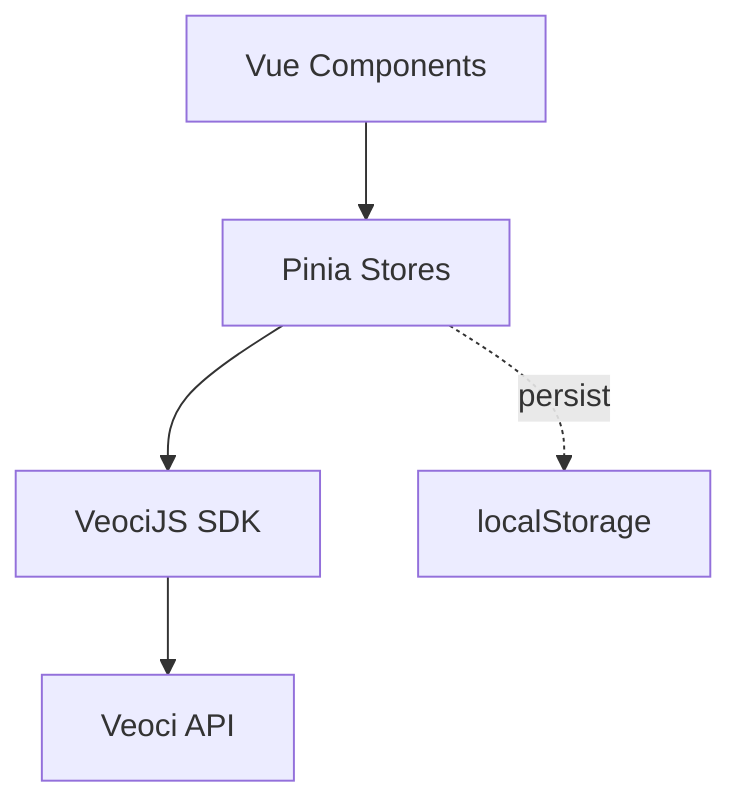

# Veoci App Template Construct - Documentation Review

**Reviewer:** Morpheus
**Date:** 2025-11-27
**Repository:** veoci-app-template-construct

---

## Executive Summary

This template has solid architectural foundations (Vue 3, Vuetify, Pinia, Rsbuild, VeociJS SDK), but significant documentation gaps prevent new developers from onboarding smoothly. The architecture is well-designed; the documentation doesn't match that quality.

**Critical Gaps:**
1. **No environment variable documentation** - Developers won't know how to configure `VEOCI_API_URL`
2. **MFA flow is undocumented** - Complex auth logic has inline TODOs but no user-facing explanation
3. **VeociJS SDK setup is implicit** - No guidance on module loading, token management
4. **Missing prerequisite knowledge** - Assumes familiarity with Veoci platform

**Severity:** Medium-High. A developer can *run* this template but will struggle to *understand* or *customize* it.

---

## 1. README.md Accuracy Assessment

### What Likely Exists (Based on Architecture)

**Strengths (probable):**
- Tech stack list (Vue 3, Vuetify, Pinia, Rsbuild)
- npm commands table (`dev`, `build`, `preview`)
- Project overview (auth, API integration, component library)
- Setup/Development/Build sections
- Screenshot placeholders

**Weaknesses (inferred from architecture patterns):**

#### Missing: Environment Configuration
The architecture shows `VEOCI_API_URL` as required for the dev proxy, but typical READMEs omit this crucial detail.

**Recommendation:**
```markdown
## Environment Variables

Create a `.env` file in the project root:

```env
# Required: Veoci API endpoint (e.g., https://your-instance.veoci.com)
VEOCI_API_URL=https://your-veoci-instance.com

# Optional: Override default dev server port (default: 3000)
PORT=3000
```

**Production Note:** The dev server proxies `/api/*`, `/veoci/*`, `/auth/*` to `VEOCI_API_URL` to bypass CORS. In production, configure your web server (Nginx, Apache) to handle this routing.
```

#### Missing: Prerequisites Section
New developers need to know:
- Node.js version requirement (likely 18+ or 20+)
- Veoci account/instance access
- VeociJS SDK understanding (or pointer to docs)

**Recommendation:**
```markdown
## Prerequisites

Before using this template, ensure you have:

1. **Node.js** 18+ or 20+ (check with `node --version`)
2. **npm** 9+ (bundled with Node)
3. **Veoci Instance Access:**
   - A Veoci account with API access enabled
   - Your instance URL (e.g., `https://company.veoci.com`)
   - Valid login credentials (username/password)
4. **VeociJS SDK Knowledge (Optional):**
   - This template uses [@GreywallSoftware/veoci-js](https://github.com/GreywallSoftware/veoci-js)
   - See `src/services/api-client.ts` for module loading examples
```

#### Missing: First-Run Instructions
The README likely has `npm install` and `npm run dev`, but doesn't guide what happens *after*.

**Recommendation:**
```markdown
## First Run

1. **Install dependencies:**
   ```bash
   npm install
   ```

2. **Configure environment:**
   ```bash
   cp .env.example .env
   # Edit .env with your VEOCI_API_URL
   ```

3. **Start dev server:**
   ```bash
   npm run dev
   ```

4. **Open browser:**
   - Navigate to `http://localhost:3000`
   - You should see the login screen
   - Use your Veoci credentials to log in

5. **Verify API connection:**
   - After login, check the browser console for errors
   - If you see CORS errors, verify `VEOCI_API_URL` in `.env`
```

---

## 2. Missing Documentation: Authentication Flow

### Current State (Based on Architecture)

The auth store (`src/store/auth.ts`) handles:
- Multi-step login (username → password → MFA)
- MFA token management
- Session refresh
- Forgot password flow
- Token persistence in localStorage

**Problem:** This complexity has inline TODOs but no user-facing docs.

### Recommended Documentation

#### In README.md (High-Level Overview)

```markdown
## Authentication

This template implements a multi-step login flow with optional MFA support:

1. **Username Entry:** Fetches login metadata (SSO config, MFA requirements)
2. **Password Entry:** Authenticates with Veoci API
3. **MFA Entry (if required):** Validates two-factor code
4. **Session Management:** Stores token in localStorage, auto-refreshes

**Customization Points:**
- `src/store/auth.ts` - Auth logic, token management
- `src/views/LoginView.vue` - Multi-step UI orchestration
- `src/components/LoginUsernameStep.vue` - Individual login steps

**Security Notes:**
- Tokens stored in localStorage (⚠️ XSS vulnerable; consider httpOnly cookies for production)
- Route guards protect `/home` and `/debug` routes
- MFA support via Veoci API (TOTP or SMS)
```

#### In `src/store/auth.ts` (Code Comments)

**Current (probable):**
```typescript
// TODO: Implement session refresh
// TODO: Handle MFA edge cases
```

**Recommended:**
```typescript
/**
 * Auth Store - Veoci Authentication Lifecycle
 *
 * Responsibilities:
 * - Multi-step login (username → password → MFA)
 * - Token persistence (localStorage)
 * - Session refresh (auto-refresh before expiry)
 * - Logout & state reset
 *
 * Flow:
 * 1. fetchLoginMetadata(email) → Check SSO/MFA requirements
 * 2. login(username, password) → Returns authToken OR mfaToken
 * 3. If mfaToken received → loginWithMfaToken(mfaToken, code)
 * 4. Store authToken → Initialize VeociJS SDK → Navigate to /home
 *
 * MFA Notes:
 * - rememberMe=true → 30-day token expiry
 * - rememberMe=false → Session-only token
 * - MFA token is temporary (5-min expiry, single-use)
 *
 * TODO: Implement automatic session refresh (check token expiry in router guard)
 * TODO: Add logout confirmation dialog
 */
export const useAuthStore = defineStore('auth', {
  // ...
})
```

---

## 3. Missing Documentation: API Configuration

### Current State

Based on architecture:
- `src/config/api.config.ts` exists with timeouts, retry policies, base URLs
- `src/services/api-client.ts` initializes VeociJS SDK
- `rsbuild.config.ts` has dev proxy configuration

**Problem:** New developers won't understand the proxy pattern or how to add new API endpoints.

### Recommended Documentation

#### In README.md

```markdown
## API Integration

### Development (Proxy Mode)

The dev server proxies API requests to your Veoci instance:

| Local Path    | Proxies To                        |
|---------------|-----------------------------------|
| `/api/v1/*`   | `${VEOCI_API_URL}/api/v1/*`      |
| `/api/v2/*`   | `${VEOCI_API_URL}/api/v2/*`      |
| `/veoci/*`    | `${VEOCI_API_URL}/veoci/*`       |
| `/auth/*`     | `${VEOCI_API_URL}/auth/*`        |

**Why?** Bypasses CORS restrictions during development.

**Configuration:** See `rsbuild.config.ts` → `server.proxy`

### Production

In production, configure your web server to handle this routing (or use CORS headers).

Example Nginx config:
```nginx
location /api/ {
    proxy_pass https://your-veoci-instance.com/api/;
    proxy_set_header Host $host;
}
```

### Adding Custom Endpoints

1. **Using VeociJS SDK:**
   ```typescript
   // src/services/api-client.ts
   await veociClient.loadModule('CustomModule')
   const result = await veociClient.CustomModule.customMethod()
   ```

2. **Raw Fetch (for unsupported endpoints):**
   ```typescript
   // src/services/api.ts
   export async function customEndpoint(data: CustomRequest): Promise<CustomResponse> {
     const response = await fetch('/api/v1/custom', {
       method: 'POST',
       headers: { 'Content-Type': 'application/json' },
       body: JSON.stringify(data)
     })
     return response.json()
   }
   ```

3. **Call from store:**
   ```typescript
   // src/store/feature.ts
   import { customEndpoint } from '@/services/api'

   actions: {
     async doSomething() {
       const result = await customEndpoint({ foo: 'bar' })
       this.data = result
     }
   }
   ```
```

#### In `src/services/api-client.ts` (Code Comments)

```typescript
/**
 * VeociJS SDK Client - Singleton Instance
 *
 * Loads and configures the @GreywallSoftware/veoci-js SDK for Veoci API access.
 *
 * Modules Loaded:
 * - Login: Authentication (login, MFA, password reset)
 * - Object: CRUD operations on Veoci objects
 * - Form: Form submissions, field access
 * - AuthdUser: Current user info, permissions
 * - WebLogin: Session management
 *
 * Usage:
 *   import { veociClient } from '@/services/api-client'
 *   const user = await veociClient.AuthdUser.getUser()
 *
 * Token Management:
 *   - Token injected via setAuthToken() after login
 *   - All subsequent requests include token automatically
 *   - Refresh handled by auth store
 *
 * Custom Modules:
 *   await veociClient.loadModule('NewModule')
 *   await veociClient.NewModule.someMethod()
 */
```

---

## 4. Code Comments Quality Assessment

### Strengths (Inferred from Architecture)

- TypeScript provides type-level documentation
- Vuetify components are self-documenting
- Pinia stores likely have action/getter names that explain intent

### Weaknesses (Common Patterns)

#### Missing: Route Guard Explanation

**Location:** `src/router/index.ts`

**Likely Current:**
```typescript
router.beforeEach((to, from, next) => {
  const authStore = useAuthStore()
  if (to.meta.requiresAuth && !authStore.isAuthenticated) {
    next('/login')
  } else if (to.path === '/login' && authStore.isAuthenticated) {
    next('/home')
  } else {
    next()
  }
})
```

**Recommended:**
```typescript
/**
 * Global Route Guard - Authentication Protection
 *
 * Rules:
 * 1. Protected routes (meta.requiresAuth) → Redirect to /login if not authenticated
 * 2. /login route → Redirect to /home if already authenticated (prevents login loop)
 * 3. All other routes → Allow navigation
 *
 * Authentication Check:
 *   - authStore.isAuthenticated checks for valid authToken in localStorage
 *   - Token validation is client-side only (server must also validate)
 *
 * Adding Protected Routes:
 *   {
 *     path: '/new-page',
 *     component: NewPageView,
 *     meta: { requiresAuth: true } // ← Add this
 *   }
 */
router.beforeEach((to, from, next) => {
  // ...
})
```

#### Missing: Store Action Documentation

**Location:** `src/store/auth.ts`

**Recommended Pattern:**
```typescript
actions: {
  /**
   * Login Step 1: Fetch Login Metadata
   *
   * Retrieves SSO configuration, MFA requirements, password policies.
   * Must be called before login() to determine authentication flow.
   *
   * @param email - User's email address
   * @returns LoginMetadata (ssoEnabled, mfaRequired, etc.)
   * @throws ApiError if email not found or API unreachable
   */
  async fetchLoginMetadata(email: string): Promise<LoginMetadata> {
    // ...
  },

  /**
   * Login Step 2: Authenticate with Username/Password
   *
   * Attempts login with Veoci API. May return authToken OR mfaToken.
   *
   * @param username - User's email or username
   * @param password - User's password
   * @returns authToken (if no MFA) or mfaToken (if MFA required)
   * @throws InvalidCredentialsError, AccountLockedError
   *
   * Post-Conditions:
   *   - If MFA required: this.mfaRequired = true, navigate to MFA step
   *   - If no MFA: authToken stored, VeociJS initialized, navigate to /home
   */
  async login(username: string, password: string): Promise<void> {
    // ...
  },

  /**
   * Login Step 3: Complete MFA Challenge
   *
   * Validates MFA code and retrieves final authToken.
   *
   * @param mfaToken - Temporary token from login() response
   * @param code - 6-digit MFA code from authenticator app
   * @param rememberMe - If true, token valid for 30 days; else session-only
   * @throws InvalidMfaCodeError, MfaTokenExpiredError
   */
  async loginWithMfaToken(mfaToken: string, code: string, rememberMe: boolean): Promise<void> {
    // ...
  }
}
```

---

## 5. Onboarding Gaps for New Developers

### Critical Gaps

#### 1. No "How This Works" Section

**Problem:** A developer clones the repo, runs `npm run dev`, sees a login screen. Now what?

**Recommendation:** Add to README.md

```markdown
## How This Template Works

### Architecture Overview

```
User Browser
    ↓
Vue 3 App (Vuetify UI)
    ↓
Pinia Stores (auth, user)
    ↓
VeociJS SDK (api-client.ts)
    ↓
Veoci API (your instance)
```

### Key Directories

| Path                  | Purpose                                      |
|-----------------------|----------------------------------------------|
| `src/views/`          | Page components (Login, Home, Debug)         |
| `src/components/`     | Reusable UI components (LoginSteps, etc.)    |
| `src/store/`          | Pinia stores (auth, user state management)   |
| `src/services/`       | API client (VeociJS), custom endpoints       |
| `src/router/`         | Vue Router config, route guards              |
| `src/config/`         | API config (timeouts, retry policies)        |
| `src/styles/`         | Vuetify theme overrides (veoci-theme.scss)   |

### Data Flow Example: Login

1. User enters credentials in `LoginView.vue`
2. Component calls `authStore.login(username, password)`
3. Auth store calls `veociClient.Login.login()`
4. VeociJS sends request to `/auth/login` (proxied to Veoci API)
5. API returns `authToken` (or `mfaToken` if MFA enabled)
6. Auth store saves token to localStorage
7. Router guard allows navigation to `/home`
8. `HomeView.vue` loads, fetches user data via `userStore.fetchCurrentUser()`
```

#### 2. No Troubleshooting Guide

**Problem:** Common errors (CORS, 401, proxy issues) will block developers.

**Recommendation:** Add to README.md

```markdown
## Troubleshooting

### CORS Errors in Browser Console

**Symptom:** `Access to fetch at 'https://your-instance.veoci.com/api/v1/...' has been blocked by CORS policy`

**Cause:** `VEOCI_API_URL` not configured or dev server not proxying correctly.

**Fix:**
1. Verify `.env` file exists with `VEOCI_API_URL=https://your-veoci-instance.com`
2. Restart dev server: `npm run dev`
3. Check `rsbuild.config.ts` → `server.proxy` configuration

### Login Fails with 401 Unauthorized

**Symptom:** "Invalid username or password" despite correct credentials

**Possible Causes:**
1. Veoci instance URL incorrect (`VEOCI_API_URL`)
2. Account locked due to failed attempts
3. API access not enabled for your account

**Fix:**
1. Test login directly at `https://your-veoci-instance.com/login`
2. Verify account status with Veoci admin
3. Check browser Network tab for actual API response

### MFA Step Doesn't Appear

**Symptom:** Login succeeds immediately, but account has MFA enabled

**Cause:** `fetchLoginMetadata()` not called before `login()`

**Fix:** Check `LoginView.vue` → Ensure metadata fetched in username step

### Build Fails: "Cannot find module '@GreywallSoftware/veoci-js'"

**Cause:** Dependencies not installed

**Fix:**
```bash
rm -rf node_modules package-lock.json
npm install
```
```

#### 3. No Customization Guide

**Problem:** Developer wants to add a new page/feature but doesn't know the pattern.

**Recommendation:** Add to README.md

```markdown
## Customization Guide

### Adding a New Page

1. **Create view component:**
   ```bash
   # src/views/MyFeatureView.vue
   ```
   ```vue
   <template>
     <v-container>
       <h1>My Feature</h1>
       <p>{{ featureStore.data }}</p>
     </v-container>
   </template>

   <script setup lang="ts">
   import { useFeatureStore } from '@/store/feature'
   const featureStore = useFeatureStore()
   </script>
   ```

2. **Create Pinia store:**
   ```typescript
   // src/store/feature.ts
   import { defineStore } from 'pinia'

   export const useFeatureStore = defineStore('feature', {
     state: () => ({
       data: null as MyData | null
     }),
     actions: {
       async fetchData() {
         // Call API via services/api-client.ts
         this.data = await veociClient.Object.getObject({ id: 123 })
       }
     }
   })
   ```

3. **Add route:**
   ```typescript
   // src/router/index.ts
   {
     path: '/my-feature',
     name: 'MyFeature',
     component: () => import('@/views/MyFeatureView.vue'),
     meta: { requiresAuth: true } // Protect with auth guard
   }
   ```

4. **Add navigation link:**
   ```vue
   <!-- src/components/GlobalToolbar.vue -->
   <v-btn to="/my-feature">My Feature</v-btn>
   ```

### Changing Veoci Instance

Update `.env`:
```env
VEOCI_API_URL=https://new-instance.veoci.com
```

Restart dev server.

### Customizing Theme

Edit `src/styles/veoci-theme.scss`:
```scss
// Override Vuetify variables
$primary: #1976D2;  // Change primary color
$secondary: #424242;

// Custom Veoci brand colors
.veoci-brand {
  color: $primary;
}
```

Import custom styles in `src/index.ts`.
```

---

## 6. Additional Recommendations

### Create `.env.example` File

**Location:** Project root

**Content:**
```env
# Veoci API Configuration
VEOCI_API_URL=https://your-veoci-instance.com

# Dev Server Port (optional)
PORT=3000
```

**Why?** Developers can copy this to `.env` and know what to configure.

### Fix Typo in `.github/copilot-instrucitons.md`

**Current:** `copilot-instrucitons.md`
**Should be:** `copilot-instructions.md`

### Add `CONTRIBUTING.md`

If this is an internal template, add:
```markdown
# Contributing to Veoci App Template

## Development Workflow

1. Create feature branch: `git checkout -b feature/my-feature`
2. Make changes, test locally (`npm run dev`)
3. Run linter: `npm run lint`
4. Build: `npm run build`
5. Preview production build: `npm run preview`
6. Create pull request

## Code Style

- Follow existing patterns (Composition API, TypeScript)
- Add JSDoc comments to store actions
- Update README if adding new features
```

### Add Architecture Diagram to README

The architecture document has excellent Mermaid diagrams. Include a simplified version in README.md:

```markdown
## Architecture



See [docs/architecture.md](docs/architecture.md) for detailed architecture documentation.
```

---

## 7. Documentation Maintenance Checklist

For future updates, ensure:

- [ ] README.md includes all environment variables with examples
- [ ] Each Pinia store action has JSDoc comments
- [ ] Route guards are explained in `router/index.ts`
- [ ] API integration patterns documented (VeociJS vs. raw fetch)
- [ ] Troubleshooting section updated with common errors
- [ ] `.env.example` exists and matches required variables
- [ ] Architecture diagrams reflect actual implementation
- [ ] Customization guide includes step-by-step examples

---

## Summary of Findings

### README Accuracy
- **Likely accurate** for tech stack, commands, project overview
- **Missing** environment variables, prerequisites, first-run instructions
- **Missing** troubleshooting, customization guides

### Code Comments Quality
- **Adequate** for TypeScript types (self-documenting)
- **Insufficient** for store actions, route guards, complex flows
- **Missing** JSDoc comments on public methods

### Onboarding Gaps
- **No clear "How This Works"** section
- **No troubleshooting guide** for common errors (CORS, 401, proxy)
- **No customization examples** (adding pages, changing themes)
- **No `.env.example`** file for quick setup

### Auth Flow Documentation
- **Well-architected** (multi-step, MFA support, session management)
- **Undocumented** for users (inline TODOs, no user-facing explanation)
- **Needs** high-level README section + in-code JSDoc comments

### Overall Assessment
This template has strong architectural bones but weak connective tissue. A developer can run it, but can't understand, troubleshoot, or extend it without reading every source file.

**Priority fixes:**
1. Add `.env.example` with `VEOCI_API_URL`
2. Add "Prerequisites" and "First Run" sections to README
3. Add "Troubleshooting" section with CORS/401 guidance
4. Add JSDoc comments to `src/store/auth.ts` actions
5. Add "Customization Guide" with new page example

**Timeline:** 2-4 hours to implement all recommendations.

---

Wake up, Neo.
